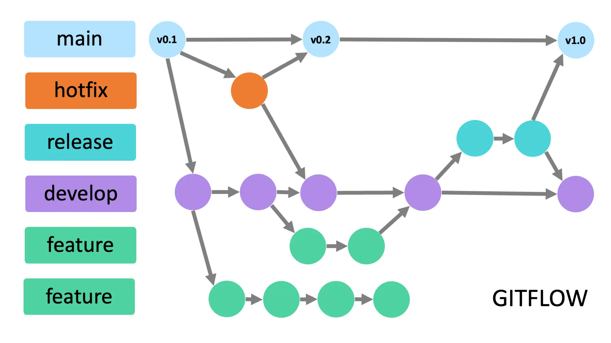
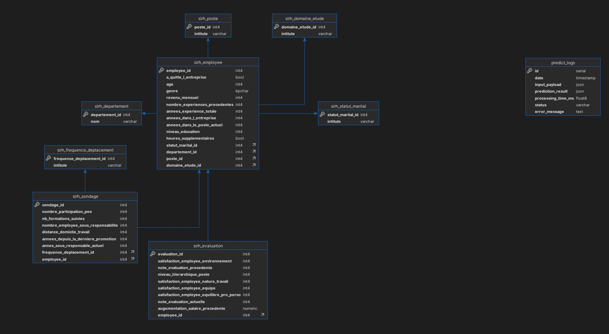

# Deploying a Production-Ready ML Model and REST API — a supervised model that predicts employee attrition at TechNova Partners

## Introduction

This project is the 5th of OpenClassroom AI-Engineer formation.
It deploys the ML model from the project n°4 : https://github.com/mgonzalez117/ai-engineer (:lock: private repository, ask me if you want an access).

In Project 4, we created an ML model to predict employee attrition at Technova Partners.

### Architectural choices 
* The project 4 model includes a pipeline that can be reused in this project thanks to the `/lib` folder.
* The project 4 model is bundled and stored on Hugging Face models. https://huggingface.co/MGonzalez117/technova-partners-rh (:lock: private repository)
* As requested, we are using Hugging Faces Spaces to deploy the API. https://huggingface.co/spaces/MGonzalez117/ai-engineer-p5 (:lock: private repository)
    * This imposes a constraint on Docker: we can only use a single container.
    * The root directory must contain the `Dockerfile`.
    * This README.md must contain a "front-matter" header
    * We therefore decided to use **SQLite** for this environment.
* On local environment, we use multiple containers for better separation of concerns (because we have to host PostGres SQL database). Ideally, this should also apply to production in a professional context.

## Getting Started

If you run this stack locally, be sure to have `docker`, then : 
* copy `.env.dist` to `.env`
* run docker stack

**Then check the collaboration Workflow :smirk:**

## Docker Stack

Locally, Use docker-compose with `docker-compose.yaml`

### Containers

* `ml_api` : Api & main run container
  * see `entrypoint.sh`, it creates database & processes inserts data from the CSV file at first launch
* `ml_postgres` : Database
* `ml_pgadmin` : Database administration interface

## Collaboration Workflow : GitFlow

For this project, we have chosen to use Gitflow.
If you want to contribute to the project, create your feature branch and make a merge request on the develop branch

* **main** : production branch
* **hotfix/*** : hotfixes branches
* **release** : temporary branch to validate the release features before merge it into main
* **develop** : development branch
* **feature/*** : feature branches

Note : name your feature branche like this `feature/[issue_number]-feature-name`

## Hugging Faces

### How to update model

Project 4 model has been uploaded here https://huggingface.co/MGonzalez117/technova-partners-rh, with the following structure : 

* (obj)
  * `pipeline` : the pipeline & model with `lib.modelisation` methods for : 
    * normalization
    * encoding
    * features
    * etc.
    * model creation (XGBoosting)
  * `expected_inputs` : all variables "X" dataframe for the model

**Important** : `lib.modelisation` **with the transformers MUST be copied into root folder of this project if we change it, because there are used into the project**. There are presently already copied.

### Space repository

https://huggingface.co/spaces/MGonzalez117/ai-engineer-p5

## Test and Deploy

Use the built-in continuous integration in GitLab. This is the workflow : 

* feature, develop, release:
   * build image
   * test
*  main :
   * build image
   * test
   * deploy on hugging faces spaces (if test succeeded)
   * (Hugging face build & deploy App)

### Gitlab : add CI/CD variables

#### Hugging Face space token
* Create an hugging face token for your space : https://huggingface.co/settings/tokens
* Go to gitlab > Settings > CI/CD : Variables
  * Add variable named `HF_TOKEN` with the created token as value (all environments)
  * `HF_REPOSITORY` : model's repository, we can use `MGonzalez117/technova-partners-rh`
  * `HF_MODEL` : model's file into repository, default is `modelp4.pkl`
  * `HF_TOKEN` : a private token ::key:: to the Hugging face repository can be asked to me

### Gitlab : Enable Registry

We use registry to store build images. Enable the registry in your Gitlab account

### Deploy on Hugging Face space

#### Variables & secrets
In Hugging face space, create following variables : 
* `DATABASE_URL`, with value `sqlite:////tmp/db.sqlite` 
* `API_TOKEN`, with your secret value initialized with projet (secret to access to this API)
* `HF_REPOSITORY` : same as Gitlab
* `HF_MODEL` : same as Gitlab
* `HF_TOKEN` : same as Gitlab ::key::
* `XDG_CACHE_HOME` : `/tmp/.cache`

**and Let the CI deploy it !**

## Database Diagram

* `sirh_*` are the dataset tables
* `predict_logs` is used to log API /predict endpoint calls

## Data initialization
* `sql/init.sql` used to create the database schema
* `entrypoint.sh`, used to create database & insert from the CSV file with `src/init/data_init.py` script

### Data Ingestion Process

The data ingestion script (`src/init/data_init.py`) performs the following steps to populate the database from CSV files:

0. **Database creation**
1. **Database Connection**: Establishes a connection to the PostgreSQL database using the `DATABASE_URL` environment variable.

2. **Check for Existing Data**: Before ingestion, it checks if the main employee table is empty to avoid duplicate data insertion.

3. **Populate Reference Tables**: Inserts predefined static data into reference tables such as domains of study, departments, job positions, marital statuses, and travel frequencies. This ensures foreign key constraints are satisfied.

4. **Create Mappings**: Builds dictionaries to map human-readable string values from CSV files to their corresponding foreign key IDs in the database.

5. **Load and Merge CSV Data**: Reads three CSV files (`extrait_sirh.csv`, `extrait_eval.csv`, `extrait_sondage.csv`), cleans and merges them into a single DataFrame for easier processing.

6. **Populate Main Tables**: Inserts data into the main tables:
   - `sirh_employee` with employee personal and job details,
   - `sirh_evaluation` with employee evaluation data,
   - `sirh_sondage` with survey-related data.

**This process is triggered automatically on container startup via the entrypoint script, ensuring the database is initialized with consistent and complete data from the CSV sources.**