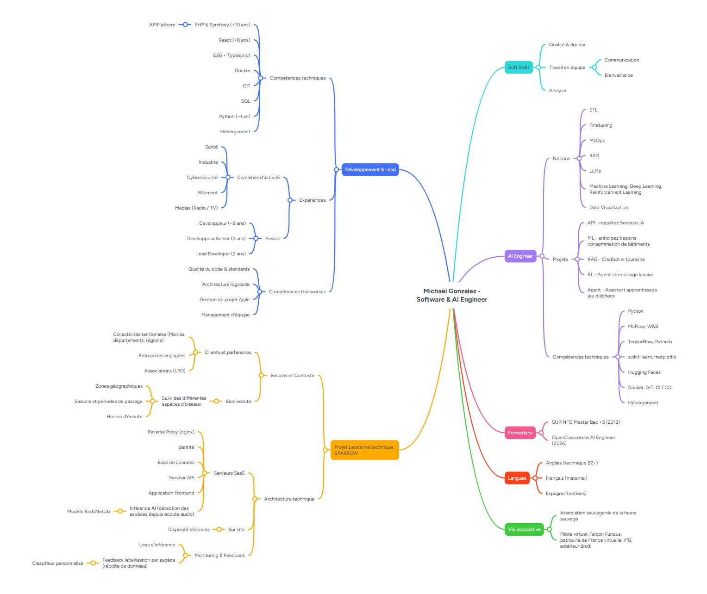
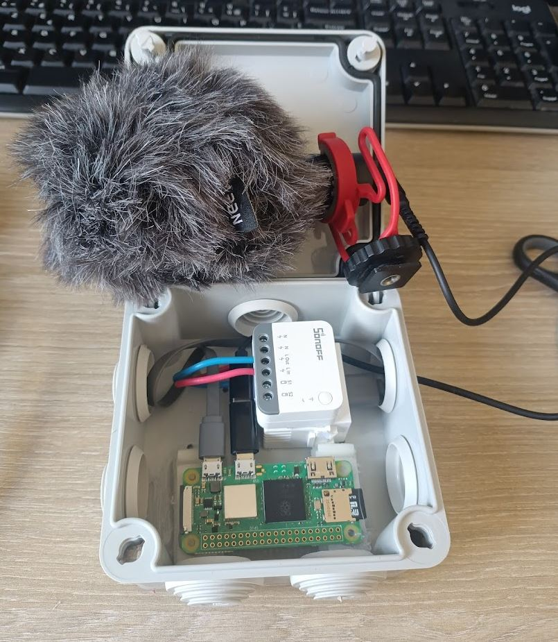
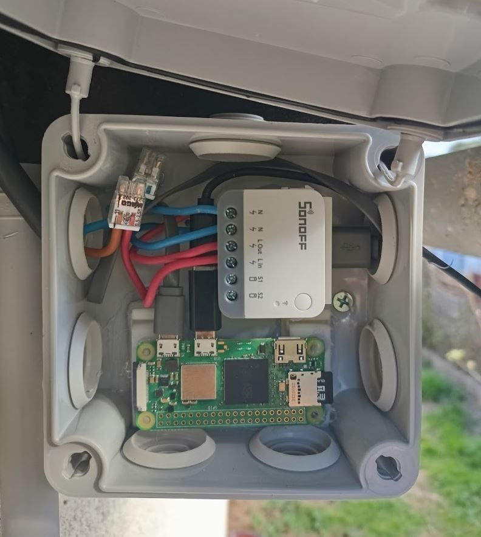
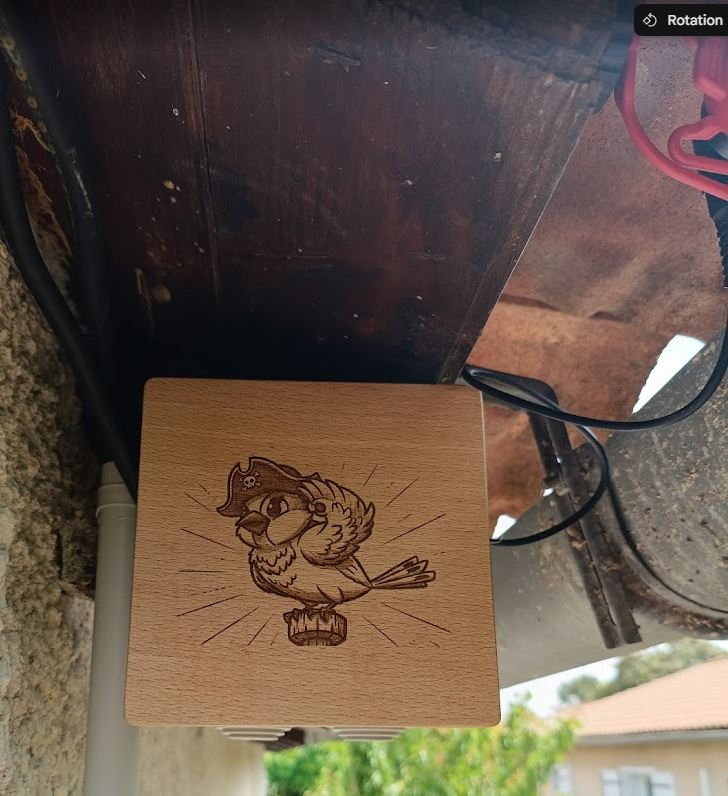
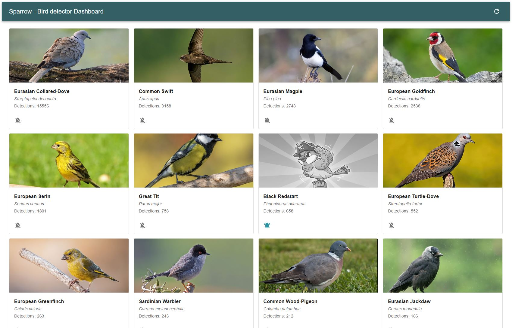

# Sparrow - Bird detector

## Introduction

### Portfolio

Le but du dernier projet de cette formation est de réaliser un portfolio professionnel.
Ce dernier est disponible à l'adresse suivante : https://mgonzalez.pro

### Projet personnel technique : Sparrow

En complément du portfolio, le sujet du dernier projet est de démontrer un projet personnel technique.
J'ai choisi un projet commencé plus tôt durant la phase de formation et qui me tient à coeur.

Il s'agit d'un détecteur (audio) d'oiseaux, permettant la classification des espèces d'oiseaux présentes dans le lieu d'implantation.

## MindMap

Voici la mindmap retenue permettant d'organiser mon portfolio.
Elle comporte mes compétences déjà acquises précédemment ainsi que les nouvelles compétences acquises lors de la formation AI Engineer d'OpenClassrooms.

Elle situe également mes expériences et mon parcours professionnel ainsi que les précédentes formations suivies.

La mindmap détaille également mon projet personnel technique **SPARROW**, qui est l'objet de ce projet.

La mindmap navigable et détaillée est disponible via le lien suivant : https://mm.tt/map/3991818334?t=f9cKah1JnR




## Projet Sparrow

### Introduction

L’idée du projet est née d’un constat simple : il existe peu de solutions accessibles permettant de détecter automatiquement les oiseaux présents dans un environnement à partir de l’audio, tout en restant autonomes, peu coûteuses et déployables facilement sur le terrain.

Le projet Sparrow vise donc à concevoir un système distribué de détection ornithologique basé sur l’analyse audio et l’intelligence artificielle.  
L’objectif est de permettre à de petits capteurs autonomes (Raspberry Pi, microphone USB, alimentation solaire potentielle) de capturer des sons ambiants, détecter une activité sonore pertinente, puis transmettre les enregistrements à un serveur d’analyse capable d’identifier les espèces détectées.

Le système repose principalement sur :
- des capteurs légers et autonomes ;
- un backend d’analyse audio basé sur BirdNET ;
- une API FastAPI pour l’inférence ;
- une base de données pour historiser les détections ;
- un système de notifications optionnel (Discord).

Le projet a plusieurs objectifs :
- expérimenter des architectures edge + IA distribuées ;
- étudier la faisabilité d’un réseau de capteurs ornithologiques basse consommation ;
- faciliter l’observation et le suivi des espèces locales ;
- construire une plateforme extensible pour de futurs usages (cartographie, statistiques, monitoring environnemental, fine-tuning de modèles, etc.).

---

### Fonctionnement général

Le projet est composé de deux éléments principaux :

#### Sensor

Le capteur (`sensor`) fonctionne sur un Raspberry Pi et :
- écoute en continu via un microphone USB ;
- détecte une activité sonore selon un seuil RMS ;
- enregistre automatiquement un extrait audio ;
- transmet le fichier WAV au serveur d’analyse.

Le capteur est conçu pour être :
- léger ;
- autonome ;
- tolérant aux coupures ;
- facilement déployable sur plusieurs sites.

#### Detector

Le serveur (`detector`) reçoit les extraits audio via une API FastAPI.

Il :
- prétraite les fichiers audio ;
- exécute l’inférence BirdNET ;
- extrait les espèces détectées ;
- stocke et historise les résultats ;
- peut envoyer des notifications Discord.

---

### Stack technique

- Python 3
- FastAPI
- BirdNET / birdnetlib
- SQLAlchemy
- MariaDB / MySQL
- Docker
- Raspberry Pi OS
- systemd
- Discord Webhooks

---

### Architecture

```text
[ Microphone ]
       ↓
[ Raspberry Pi Sensor ]
       ↓ HTTP
[ FastAPI Detector ]
       ↓
[ BirdNET Inference ]
       ↓
[ Database ]
       ↓
[ Notifications / Dashboard ]
```

### Fonctionnalités actuelles

- Détection audio par seuil RMS
- Enregistrement automatique d’extraits audio
- Transmission HTTP des fichiers
- Inférence BirdNET locale
- Historisation des détections
- Notifications Discord
- Déploiement Linux via systemd
- Support Raspberry Pi

---

### Roadmap

- Streaming RTSP audio
- Tableau de bord web
- Cartographie des détections
- Fine-tuning du modèle avec feedback utilisateur
- Support multi-capteurs
- Optimisations énergétiques pour alimentation solaire
- Détection temps réel améliorée
- Monitoring centralisé

---

### Objectif long terme

À terme, Sparrow pourrait devenir une plateforme distribuée de suivi ornithologique reposant sur un réseau de capteurs autonomes capables d’analyser la biodiversité sonore en continu.

### Installation Détecteur

Le 1er détecteur de la gamme est un Rasperry pi Zero 2WH

* Petite taille
* Peu consommateur
* Wifi intégré pour faciliter la connectivité du démonstrateur
    * On peut imaginer de futures versions avec des protocoles moins consommateurs (Zigbee, ZWave)
* OS debian raspberry lite permettant d'embarquer facilement la couche applicative de détection audio

Le détecteur est alimenté en 5V depuis un petit transformateur usb 240V-5V.

Le détecteur est précédé d'un commutateur de courant permettant de le mettre hors service et de le redémarrer à distance.
(solution intégrée en Zigbee à Home assistant pour ce démonstrateur)

<div style="display: flex; gap: 12px; flex-wrap: wrap;">
  
  
  
</div>

### Dashboard

